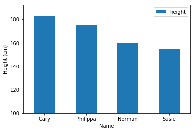

Title: Bar Plots
Slug: matplotlib/bar-plots
Category: Matplotlib
Tags: set_index, plot, xlabel, ylabel, xticks, ylim, show
Date: 2017-09-19
Modified: 2017-09-20

#### Import libraries


```python
import pandas as pd
import matplotlib.pyplot as plt
```

#### Generate some data


```python
data = {'name': ['Gary', 'Philippa', 'Norman', 'Susie'],
        'height': [183, 175, 160, 155]}

df = pd.DataFrame(data)
df.set_index('name', inplace=True)
df
```


<div>
<style>
    .dataframe thead tr:only-child th {
        text-align: right;
    }

    .dataframe thead th {
        text-align: left;
    }

    .dataframe tbody tr th {
        vertical-align: top;
    }
</style>
<table border="1" class="dataframe">
  <thead>
    <tr style="text-align: right;">
      <th></th>
      <th>height</th>
    </tr>
    <tr>
      <th>name</th>
      <th></th>
    </tr>
  </thead>
  <tbody>
    <tr>
      <th>Gary</th>
      <td>183</td>
    </tr>
    <tr>
      <th>Philippa</th>
      <td>175</td>
    </tr>
    <tr>
      <th>Norman</th>
      <td>160</td>
    </tr>
    <tr>
      <th>Susie</th>
      <td>155</td>
    </tr>
  </tbody>
</table>
</div>


#### Plot data


```python
fig = df.plot(kind='bar', figsize=(8,5))
plt.xlabel('Name')
plt.ylabel('Height (cm)')
# Labels are displayed vertically without this line
plt.xticks(rotation=0)
# Trim the y-axis for greater detail
plt.ylim(100,)
plt.show()
```



