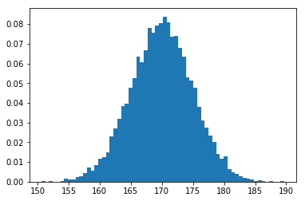

Title: Histograms
Slug: matplotlib/histograms
Category: Matplotlib
Tags: random, normal, figure, hist, xlabel, ylabel, show
Date: 2017-09-24
Modified: 2017-09-24

#### Import libraries


```python
import numpy as np
import pandas as pd
import matplotlib.pyplot as plt
```

#### Generate some data


```python
data = np.random.normal(170, 5, 10000)
data[:5]
```


    array([ 162.09113517,  164.99164192,  164.49837619,  177.63418366,
            167.79991672])


#### Plot the data


```python
fig = plt.figure(figsize=(8, 5))
plt.hist(data, bins='auto', normed=True)
plt.xlabel('Value')
plt.ylabel('Proportion')
plt.show()
```



