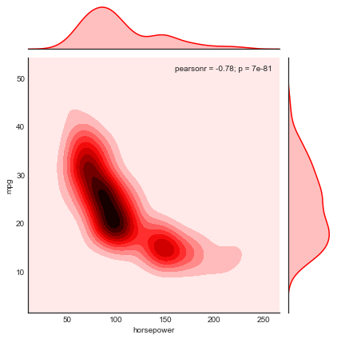
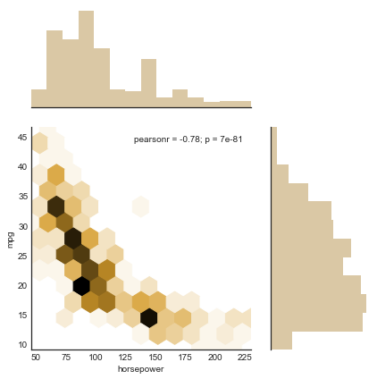

Title: Plotting Two Continuous Variables
Slug: seaborn/plotting-two-continuous-variables
Category: Seaborn
Tags: load_dataset, set_style, load_dataset, jointplot
Date: 2018-07-23
Modified: 2018-07-23

#### Import libraries


```python
import seaborn as sns
sns.set_style('white')
```

#### Load and inspect data


```python
df = sns.load_dataset('mpg')
df.head()
```


<div>
<style scoped>
    .dataframe tbody tr th:only-of-type {
        vertical-align: middle;
    }

    .dataframe tbody tr th {
        vertical-align: top;
    }

    .dataframe thead th {
        text-align: right;
    }
</style>
<table border="1" class="dataframe">
  <thead>
    <tr style="text-align: right;">
      <th></th>
      <th>mpg</th>
      <th>cylinders</th>
      <th>displacement</th>
      <th>horsepower</th>
      <th>weight</th>
      <th>acceleration</th>
      <th>model_year</th>
      <th>origin</th>
      <th>name</th>
    </tr>
  </thead>
  <tbody>
    <tr>
      <th>0</th>
      <td>18.0</td>
      <td>8</td>
      <td>307.0</td>
      <td>130.0</td>
      <td>3504</td>
      <td>12.0</td>
      <td>70</td>
      <td>usa</td>
      <td>chevrolet chevelle malibu</td>
    </tr>
    <tr>
      <th>1</th>
      <td>15.0</td>
      <td>8</td>
      <td>350.0</td>
      <td>165.0</td>
      <td>3693</td>
      <td>11.5</td>
      <td>70</td>
      <td>usa</td>
      <td>buick skylark 320</td>
    </tr>
    <tr>
      <th>2</th>
      <td>18.0</td>
      <td>8</td>
      <td>318.0</td>
      <td>150.0</td>
      <td>3436</td>
      <td>11.0</td>
      <td>70</td>
      <td>usa</td>
      <td>plymouth satellite</td>
    </tr>
    <tr>
      <th>3</th>
      <td>16.0</td>
      <td>8</td>
      <td>304.0</td>
      <td>150.0</td>
      <td>3433</td>
      <td>12.0</td>
      <td>70</td>
      <td>usa</td>
      <td>amc rebel sst</td>
    </tr>
    <tr>
      <th>4</th>
      <td>17.0</td>
      <td>8</td>
      <td>302.0</td>
      <td>140.0</td>
      <td>3449</td>
      <td>10.5</td>
      <td>70</td>
      <td>usa</td>
      <td>ford torino</td>
    </tr>
  </tbody>
</table>
</div>


#### Joint plots
This is a combination of three plots in one: the scatter plot shows the relationship between the two variables and the accompanying histograms show the distribution of each.


```python
sns.jointplot(data=df, x='horsepower', y='mpg');
```


The default plot can be changed and jazzed up in a few ways.


```python
sns.jointplot(data=df, x='horsepower', y='mpg', kind='kde', color='red');
```





```python
sns.jointplot(data=df, x='horsepower', y='mpg', kind='hex', color='#a37720', ratio=2);
```





Here are [more examples](https://seaborn.pydata.org/generated/seaborn.jointplot.html) of joint plots. For even more control over the output, use the [JointPlot class](https://seaborn.pydata.org/generated/seaborn.JointGrid.html).
